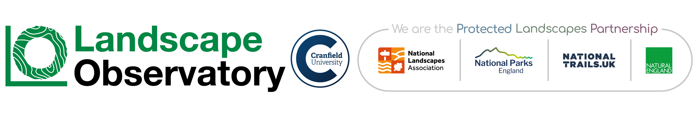

# Protected Landscapes Interpretation Key

  

  <strong>Version:</strong> v0.1 (Public draft)  
   
  <em>Last updated: {{ git_revision_date_localized }}</em>

## Introduction

This interpretation key provides guidance for the **digitisation of habitats and land cover** across protected landscapes in England.

It is designed to support the creation of **consistent, high-quality spatial data** for use in training and validating artificial intelligence (AI) models. The focus is on how habitats and land cover types should be **identified and interpreted from aerial imagery**, rather than on detailed field-based ecology.

The key builds on existing classification systems, including **UKHab**, while introducing additional distinctions that are necessary for image-based digitising and machine learning applications.

---

## Purpose of the key

This interpretation key aims to:

- provide a **clear and consistent decision framework** for digitising habitats and land cover
- reduce ambiguity between similar or transitional habitat types
- support **repeatable, scalable digitisation** across multiple protected landscapes
- enable the production of training datasets suitable for AI and automated mapping approaches

---

## How to use this site

- Start with the **Guidance** section for general digitising rules and thresholds
- Use the **Schema** page to browse the full classification structure
- Click individual habitat classes to view:
  - definitions and decision rules  
  - visual interpretation guidance  
  - example imagery and edge cases

This site is intended to be used alongside aerial imagery and GIS software during the digitisation process.

---

## Scope and limitations

This key is designed for **remote interpretation** using aerial imagery. It does not replace detailed field survey guidance and should not be used for statutory habitat condition assessment.

Where habitats form **gradual transitions**, the key prioritises visual dominance and spatial coherence to support consistent digitisation.

---

## Versioning and development

This interpretation key is a **living document** and will continue to evolve as methods, imagery and AI approaches develop.

Updates and refinements will be version-controlled through GitHub to maintain transparency and traceability.

---

## Acknowledgements

This work has been developed to support protected landscape management and data innovation across England.

## Contributors

| Name | Organisation | Role |
|------|--------------|------|
| David Alexander | Landscape Observatory | Research Lead |
| Simon Geikie | Landscape Observatory | Director |
| Sarah Rowley | Landscape Observatory | Research & Strategic Development |
| Dr Daniel Simms | Cranfield University | Senior Lecturer in Remote Sensing |
| Dr Toby Waine | Cranfield University | Head of Applied Remote Sensing |
| Dr Sam Hibdidge | Cranfield University | Postdoc Bioinformatics |
| Andy Burn | Northumberland National Park | Data & Performance Analyst |
| Emily Brazington | Forest of Bowland National Landscape | FiPL Farm Advisor |
| Dom Hartley | Forest of Bowland National Landscape | Development & Funding Officer for Lancashire Peatlands |
| Dr Kelly Harmar | Nidderdale National Landscape | Biodiversity Officer |
| Henry Barrett | North Pennines National Landscape | Data, Monitoring and Citizen Science Officer |
| Dr Peter Matthews | High Weald National Landscape | GIS Officer |
| Dr Sally Marsh | High Weald National Landscape | Director |
| Heather Cuthill | Peak District National Park Authority | Data Officer |
| Dr Lynsey Robinson | South Downs National Park | Ecology Planning Lead |
| Jan Knowlson | South Downs National Park | Biodiversity Officer |
| Natalie Singleton | Dedham Vale and Suffolk & Essex Coast Heaths National Landscape | National Landscape Officer |
| Genny Calvert | Yorkshire Dales National Park Authority | Wildlife Conservation Officer |

